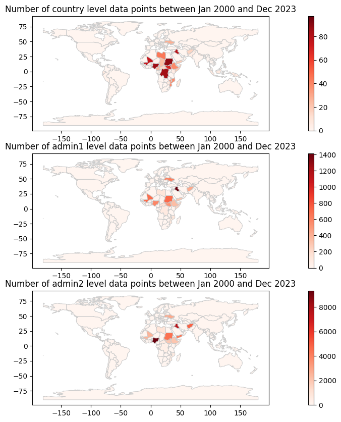

# PyDTM

A Python toolkit for [IOM's DTM API](https://dtm.iom.int/data-and-analysis/dtm-api) using the `requests` package.

## Overview of the number of samples per countries at each administrative levels.

## Contributions
If you wish to contribute, please fork this repository and create a pull request with your improvements.
