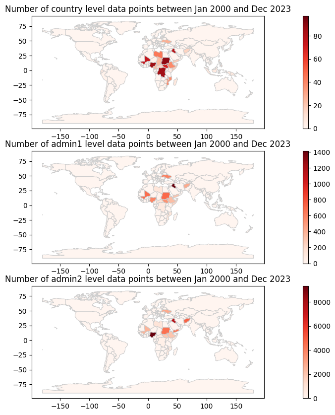

# PyDTM

A Python toolkit for [IOM's DTM API](https://dtm.iom.int/data-and-analysis/dtm-api) using the `requests` package.

## Installation
[PyDTM is avaliable on PyPi](https://pypi.org/project/pydtm/), you can import it into your python environment with:
`pip install pydtm`.

## Documentation
``pydtm``'s documentation is available on [readthedocs.org](https://pydtm.readthedocs.io/en/latest/index.html).

## Overview of the number of samples per countries at each administrative levels.

## Contributions
If you wish to contribute, please fork this repository and create a pull request with your improvements.
